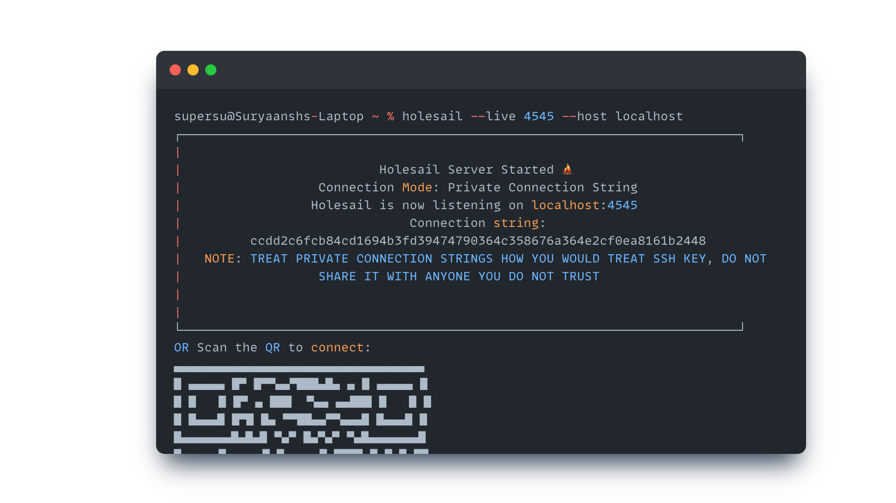

# Holesail executable (Windows, Linux, Mac)

Holesail compiled executables for **Terminal** are available for all major platforms, i.e., Windows, Mac, and Linux. This procedure does not require installing or setting up Nodejs. You can simply download the executable and use it from the terminal.

## Step 1: Download Holesail executable

Head over to the[ latest release](https://github.com/holesail/holesail/releases/latest) page of Holesail on github and download the package that is compatible with your operating system and architecture.

If you do not download the correct file, it will result in an "unsupported architecture" error.

<figure><figcaption></figcaption></figure>

## Step 2: Mark as executable

On Mac and Linux, you need to mark the downloaded package as executable. CD to the directory where you have saved the file in Terminal and run the following command:

```bash
chmod +x holesail*
```

## Step 3: Run Holesail from Terminal

You can now call Holesail from the terminal by running it from the same directory where you have saved it:


Make sure you are using the correct name for Holesail while executing this command


```bash
./holesail-macos-arm64-signed --help
```

<figure><figcaption></figcaption></figure>

### Windows: Run Holesail from command prompt

On Windows, the process is slightly different:

1. Open Command prompt.
2. Go to the directory where holesail is saved.
3. Enter the name of the package, for example "[holesail-win-x64-unsigned.exe](https://github.com/holesail/holesail/releases/download/1.6.1/holesail-win-x64-unsigned.exe)" and press enter.
4. You will see a error message saying Invalid arguments, that implies holesail is now working on your system.
5. Check out usage guide. Use appropriate options and you are good to go.
